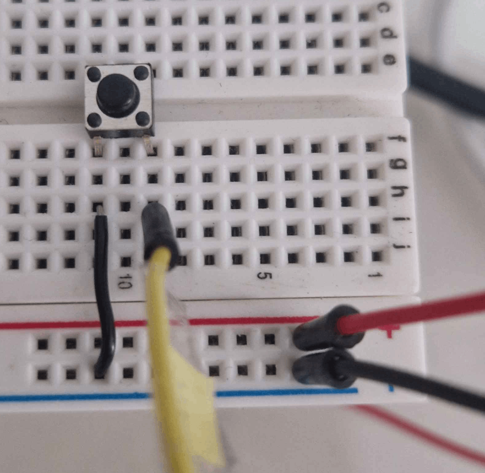
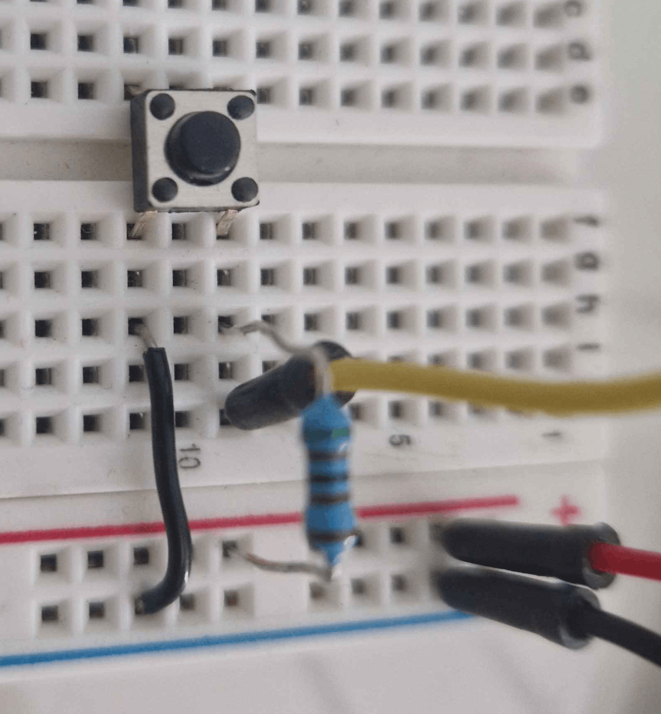
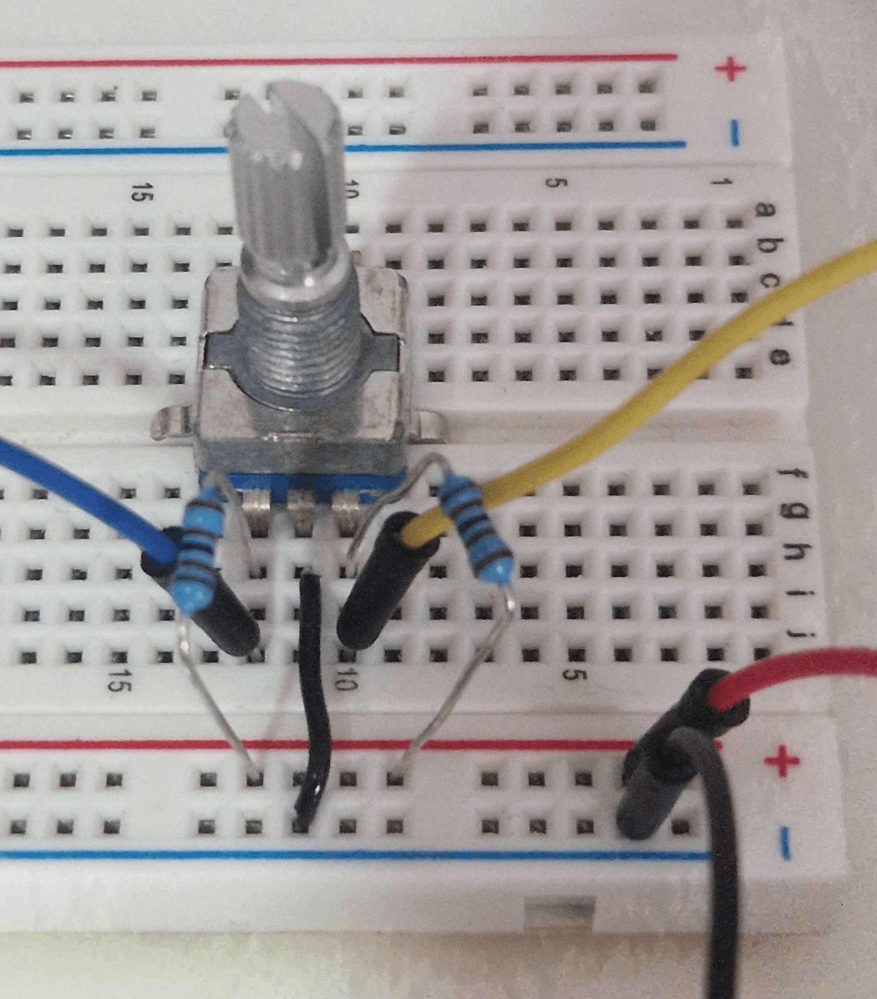

# Installation and usage

## Prerequisites

You probably want to use a Linux system to install Sparklet. Windows _should_ work too, but it's untested. Particularly,
since Nix is Linux-only and used to get the rest of the packages at specific versions, they might need to be installed
manually. However [WSL](https://learn.microsoft.com/en-us/windows/wsl/install) might work. Make an issue and we can try
to figure it out!

You will need to:

- Install [Git](https://git-scm.com/install/).
- [Clone](https://docs.github.com/en/repositories/creating-and-managing-repositories/cloning-a-repository)
  the [Sparklet repository](https://github.com/miniluz/sparklet).
- Install [Nix](https://nixos.org/download/) (pick the multi-user installation if you have no preference).
- If in Linux, add `probe-rs`'s [udev rules](https://probe.rs/docs/getting-started/probe-setup/#linux-udev-rules).
- Have an STM32 board. To see the boards Sparklet currently supports, check the `[features]` section of
  [`sparklet/runner/Cargo.toml`](https://github.com/miniluz/sparklet/blob/main/sparklet/runner/Cargo.toml).
- If you want to be able to change the configuration of Sparklet at runtime with peripherals, (knobs and buttons), you
  will need to buy three rotative encoders and two buttons. Any should do. You will also need at least 8 resistances of
  5K to 50K ohms, and wires to connect it all together (for this, I would recommend a breadboard and jumper wires).
  **This is not needed**, you can always configure it through MIDI. But it's cool.

### Other boards

If you want to use another board, you will need to do some development work. I am willing to help with this. If you don't
feel up to the task, open an issue and I'll try to help!  However, do read the beginning of the "Adding support for a new
device" section of the [development page](./02_Development.md), just to make sure that your board _can_ be supported.

## Installation

### Prepare the configuration

At the root of the repository you cloned, you will want to run `nix-shell -A "devShells.x86_64-linux.user"`. This will
provide a shell with the software you will need to compile Sparklet. If using a shell that isn't Bash, you might need
[any-nix-shell](https://github.com/haslersn/any-nix-shell). If you open a new shell, you will need to run it again.

Once it's done, you will prepare the configuration like so:

```bash
# Move to the runner folder
cd sparklet/runner/

# Copy the Config.example.toml
cp Config.example.toml Config.toml

# Edit the Config.toml
nano Config.toml
```

The configuration file will allow you to specify the chip model and to enable and disable various features of Sparklet,
like whether to use MIDI through USB or DIN, whether or not to include the equalizer, the polyphony limit, the initial
configuration that the oscillator, ADSR and equalizer will have, and whether or not you will be able to change it when
it's running through MIDI or peripherals. The simplest way to use Sparklet is by using USB for audio and MIDI, in which
case you may just plug it into your computer and play.

This file is read *at compile time*, so if you change it, *you will need to recompile Sparklet and
install it on your microcontroller again*.


### Plug in your board

Plug in your board through USB. If you have a development board (with a JLink or ST-Link), check that `probe-rs` can
find it:

```bash
probe-rs list
```

If you don't, you need to look up how to activate DFU mode. Normally this is done plugging it in while
holding the `BOOT0` button down. It should then show up when running:

```bash
dfu-util -l
```

In either case, if it isn't showing up, try running the commands as `sudo`:

```bash
sudo probe-rs list
# or
sudo dfu-util -l
```

If they show up _then_, you're probably missing `udev` rules that allow your user to control the USB ports directly.
You might still get things working by running the rest of the needed commands as `sudo` (e.g. `sudo command`), but I'd
recommend adding the rules.

### Compile and write the software

Finally, run:

```bash
./run-with-flags.sh cargo run --release

# If you want logging (Only through ST-Link or JLink)
DEFMT_LOG=error ./run-with-flags.sh cargo run --release
# or
DEFMT_LOG=info ./run-with-flags.sh cargo run --release
```

If you own a development board, `probe-rs` should run the program.

If you don't, you will need to manually install the firmware. Look up the offset at which code begins in memory
for your board (probably `0x08000000`) and run:

```bash
# CHANGE THE OFFSET AS APPROPRIATE
#                vvvvvvvvvv
dfu-util -a 0 -s 0x08000000:leave -D ../target/thumbv7em-none-eabihf/release/runner.bin`
#                                              ^^^^^^^^^^^^^^^^^^^^^
# You might also need to change the architecture
```

### Wiring

If you chose to make Sparklet configurable through peripherals, you will need to connect it to two buttons and three
rotative encoders, as follows. Open `sparklet/runner/src/hardware/config/<your_board>.rs` and you will see which
pins are needed for what.

Let's take as an example the STM32H723ZG. Open `sparklet/runner/src/hardware/config/stm32f723zg.rs`, and you will see
the following:

```rs
ConfigHardware {
    button_next_page: BUTTON_NEXT_PAGE.init(InputWithPolarity::<ActiveLow>::new(
        // A0, left, left, first from top of split
        Input::new($peripherals.PA3, Pull::Up),
    )),
    button_prev_page: BUTTON_PREV_PAGE.init(InputWithPolarity::<ActiveLow>::new(
        // Internal
        Input::new($peripherals.PC13, Pull::None),
    )),
    encoder0: ENCODER0_QEI.init(Qei::new(
        $peripherals.TIM2,
        // D20, right, left, fifth from top
        QeiPin::new($peripherals.PA15),
        // D23, right, left, eighth from top
        QeiPin::new($peripherals.PB3),
    )),
    encoder1: ENCODER1_QEI.init(Qei::new(
        $peripherals.TIM3,
        // D12, right, right, sixth from top
        QeiPin::new($peripherals.PA6),
        // D23, D11, right, right, seventh from top
        QeiPin::new($peripherals.PB5),
    )),
    encoder2: ENCODER2_QEI.init(Qei::new(
        $peripherals.TIM4,
        // D1 right, right, seventh from top of split
        QeiPin::new($peripherals.PB6),
        // D0 right, right, eighth from top of split
        QeiPin::new($peripherals.PB7),
    )),
}
```

First, let's start with the buttons. The next page button is on the pin `PA3`, which corresponds to the output on the
Nucleo-144 marked `A0`. Yes, the specified name might not match the internal pin name! Check the specification for your
board (search online for something like "nucleo-144 pinout"). You can see also that it's configured with the internal
pull-up and that it's active low. Therefore you will need to wire it like so. The red cable to the right should connect
to `5V`, the black to `GND`, and the yellow to `PA3` (the input marked `A0`).



If instead of `Pull::Up` it was `Pull::None`, you would need to wire it like this instead:



The second button is marked as the internal button, so it's on the board already. No need to wire it if you're using the
Nucleo-144.

Finally, the encoders are wired like so, with the yellow pin going to the first pin specified and the blue to the second.
You can reverse them in the configuration file by specifying a negative `parameters.encoder_multiplier`, along with
adjusting their sensitivity. This example uses 5K ohm resistances, which work fine.



## Running Sparklet

### Connect the synthesizer

Connect the device through USB to the computer, either through the USB port linked to the board if using, say, a Nucleo,
or by disconnecting and reconnecting the board without holding the `BOOT0` if using a non-development board. Sparklet
should show up as an audio source and MIDI sink. You may route MIDI to it and use it as an input in your DAW of choice.

### Configuring it at runtime

If `features.midi-config` is enabled, Sparklet will be configurable at runtime through MIDI control change (CC) signals.
Controls work as follows. If `features.peripheral-config` is enabled, you will also be able to configure it using three
rotative encoders (knobs) and two buttons, as has been mentioned. Sparklet follows a pagination format, and should boot
on page 1. The buttons are used to switch between the pages, wrapping around. The following is configurable:


| Control number | Page | Encoder | Parameter |
| -------------- | ---- | ------- | --------- |
| 102 | 1 | 1 | Attack |
| 103 | 1 | 2 | Sustain |
| 104 | 1 | 3 | Decay / Release |
| 105 | 2 | 1 | Wave |
| 106 | 2 | 2 | -- |
| 107 | 2 | 3 | -- |
| 108 | 3 | 1 | Equalizer lows (< 250 Hz) |
| 109 | 3 | 2 | Mid-lows (~500 Hz) |
| 110 | 3 | 3 | Mids (~1000 Hz) |
| 111 | 4 | 1 | Mid-highs (~2000 Hz) |
| 112 | 4 | 2 | Highs (~4000 Hz) |
| 113 | 4 | 3 | Very highs (~8000 Hz) |
